# 💬 LearnMate – Agentic AI for Personalized Course Pathways

 

An **AI-powered learning coach** that helps learners discover, plan, and follow optimal learning paths tailored to their interests and goals. LearnMate assesses skills, understands preferences, and dynamically generates personalized course roadmaps using IBM Watsonx.ai and Retrieval-Augmented Generation (RAG).

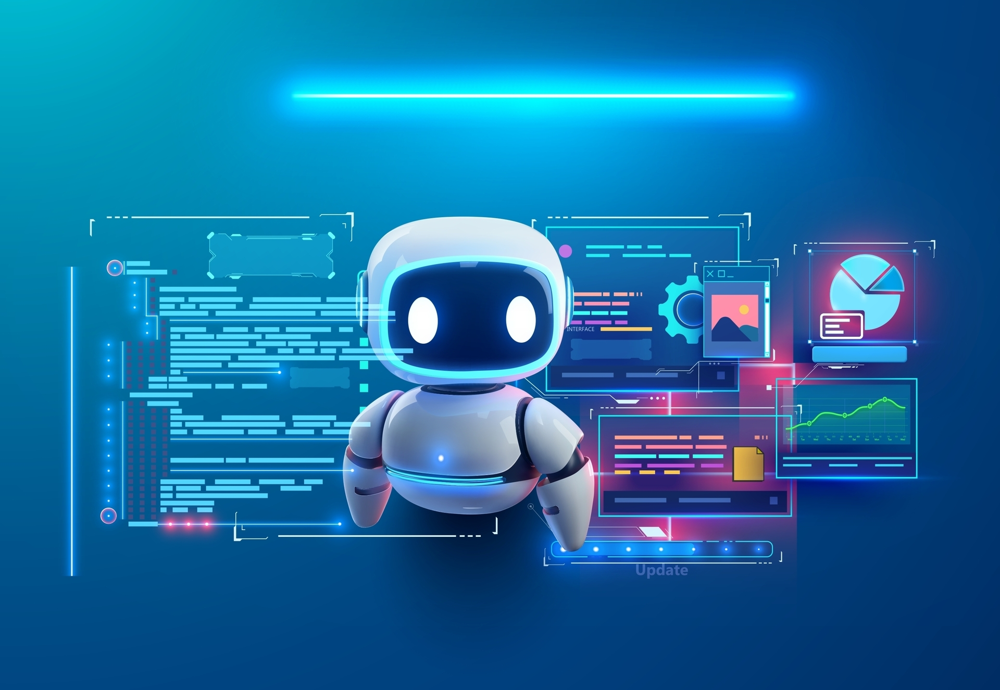
---

## 🧩 Problem Statement

Students are overwhelmed by the abundance of online courses and lack personalized guidance, leading to confusion, low motivation, and inefficient learning. They struggle to align learning paths with career aspirations like Frontend Development, Cybersecurity, UI/UX Design, etc.

---

## 💡 Solution

**LearnMate** is an Agentic AI coach that:
- Interacts with learners to understand interests and goals
- Assesses current skill levels
- Constructs adaptive, personalized learning roadmaps
- Refines recommendations over time based on progress and feedback

---

## 🧠 Technologies Used

- IBM Watsonx.ai Studio  
- IBM Granite Foundation Model (LLM)  
- Retrieval-Augmented Generation via Vector Index  
- Natural Language Processing (NLP)  
- IBM Cloud Object Storage  
- Course & skill knowledge sources (curated documents)

---

## ☁️ IBM Cloud Services

- Watsonx.ai Studio  
- IBM Granite Model  
- Watsonx Vector Index  
- IBM Cloud Lite Account  
- IBM Cloud IAM  
- IBM Cloud Object Storage  

---

## 👥 Target Users

- Students exploring career directions  
- Graduates entering the job market  
- Professionals seeking reskilling/upskilling  
- Career counselors & educators  
- EdTech platforms  

---

## 🌟 Key Differentiators

- Adaptive roadmap generation (goal- and progress-aware)  
- RAG-backed grounded answers from curated course/skill docs  
- Full IBM Cloud-native implementation  
- Polite handling of off-topic questions  
- Multi-domain coverage (e.g., Web Dev, Security, Design)  
- Goal-driven rather than generic recommendations  

---

## 🧪 Core Features

- Interest & skill assessment via conversational AI  
- Personalized, stepwise learning roadmap creation  
- Dynamic adaptation based on learner progress  
- Document-based Q&A for course/skill insights  
- Natural language understanding powered by Granite LLM  
- Off-topic redirection with graceful messaging  

---

## 🚀 Architecture / How It Works

1. **Learner Interaction:** User states interests and career goals.  
2. **Assessment:** AI evaluates skill levels through questions.  
3. **Roadmap Generation:** Personalized learning path is created.  
4. **Progress Tracking:** System monitors advancement and adjusts.  
5. **Guidance:** Continuous recommendations, tips, and next steps.  

---

## 🖼️ Screenshots

- Setup & Preview
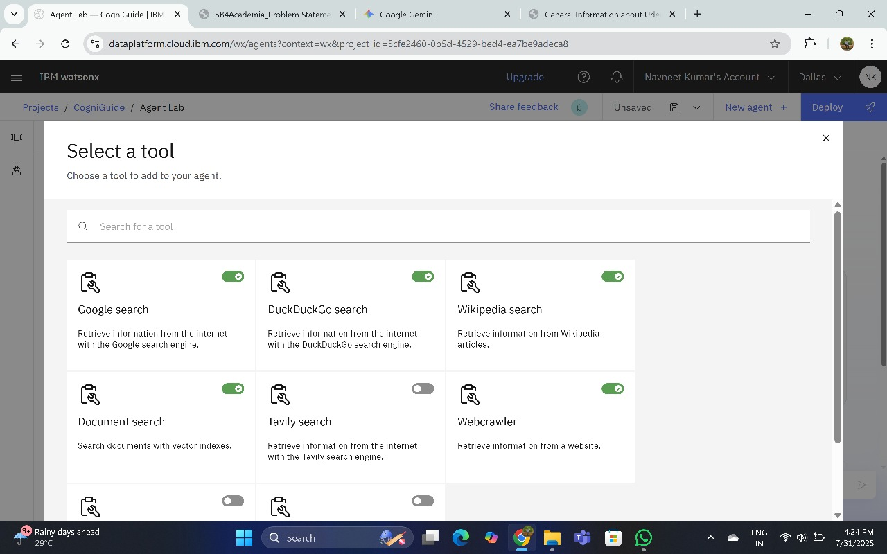
- Agent Instructions
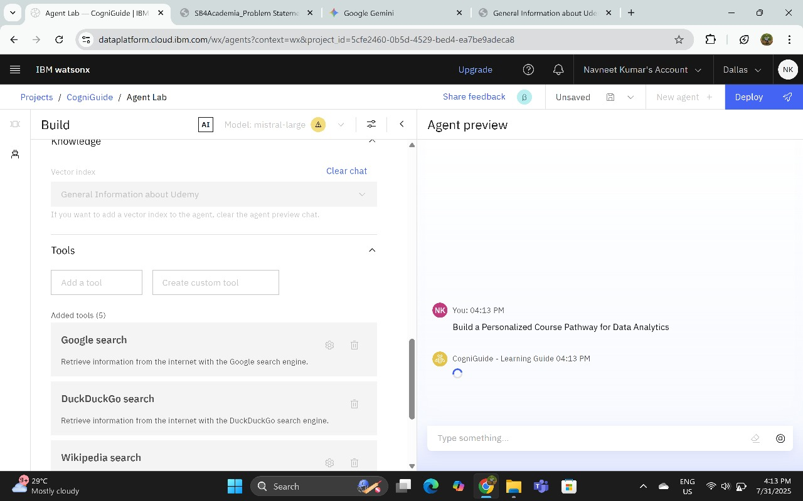

- Quick Start Questions
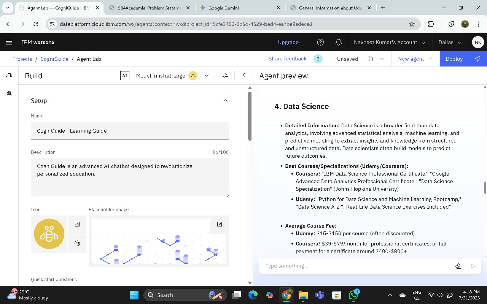
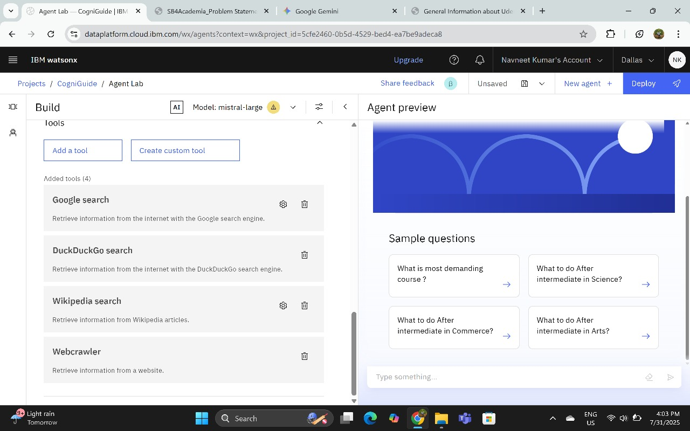
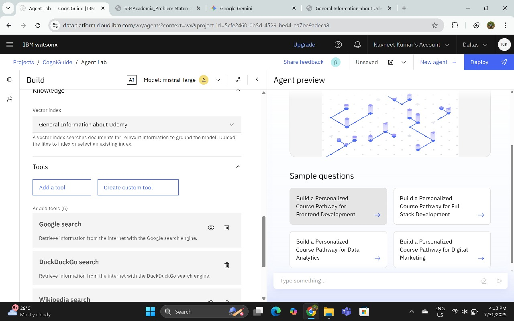
- Tools & Testing
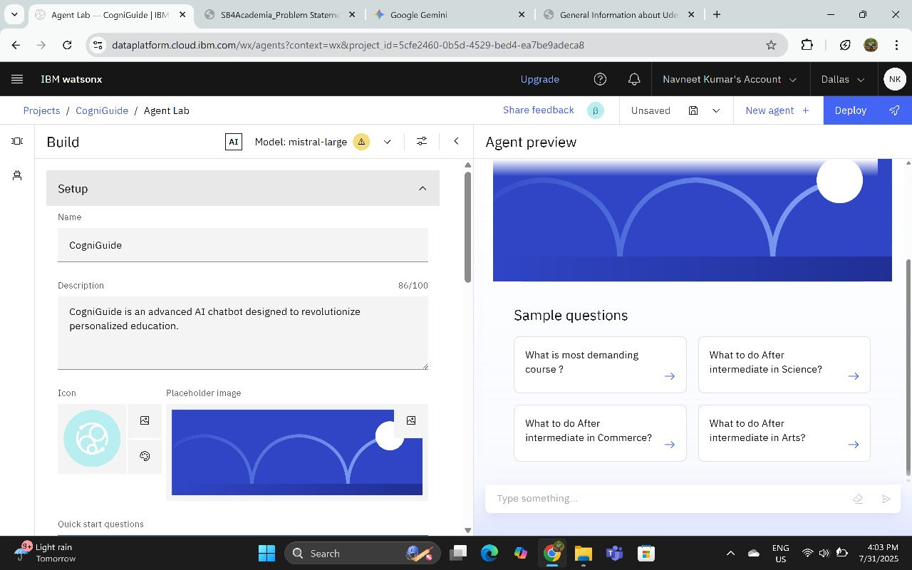
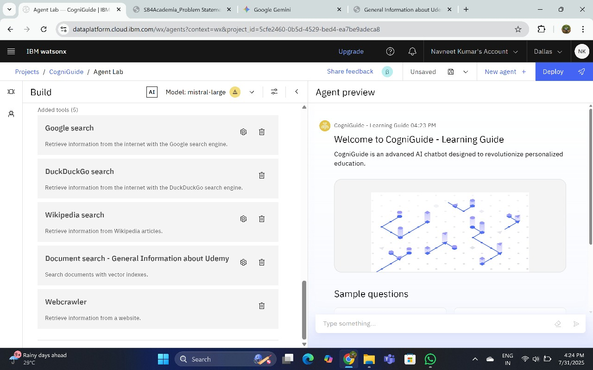
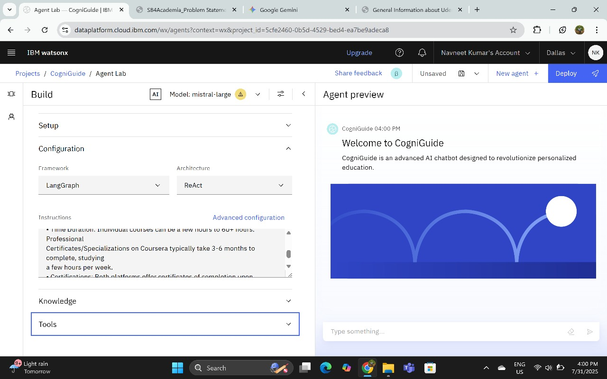
- Deployment & Live Preview
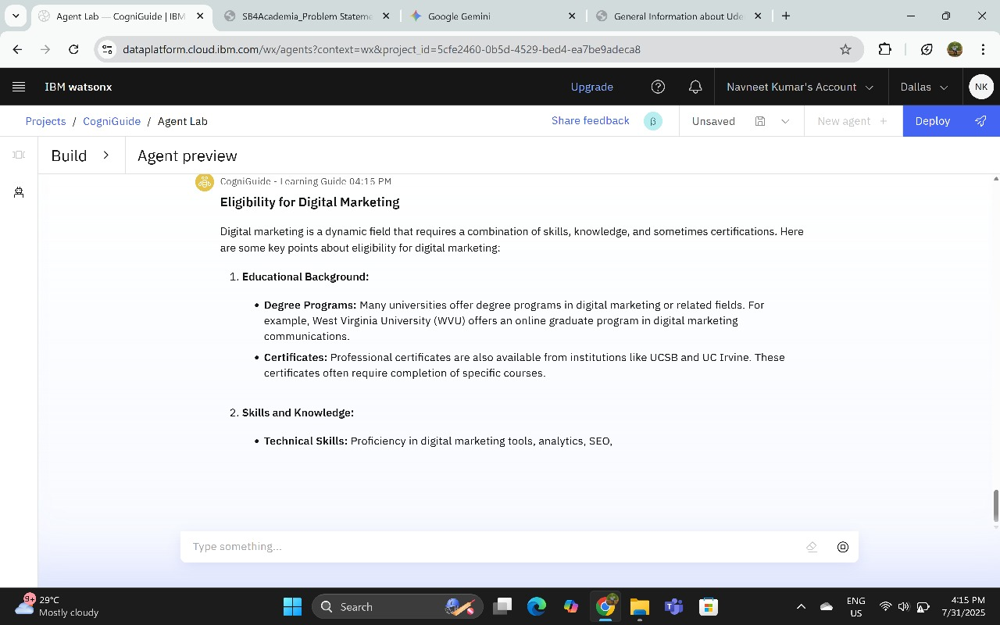
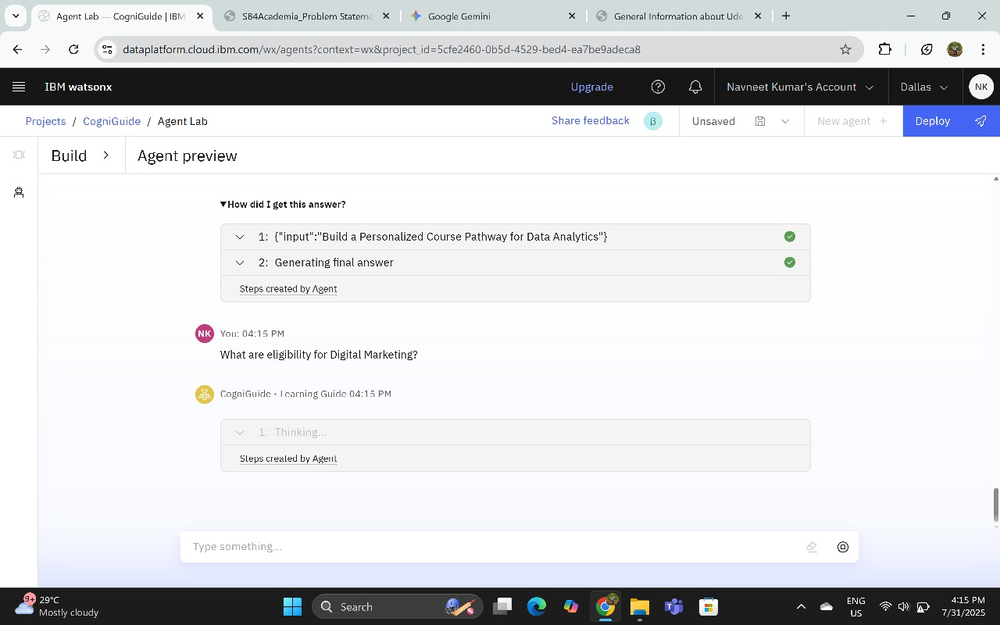

---

## 📌 Getting Started / Deployment

1. Sign in to IBM Cloud Lite: https://cloud.ibm.com  
2. Open **Watsonx.ai Studio**  
3. Create a new AI Agent  
4. Upload curated course & skill documents into a Vector Index  
5. Configure retrieval tools and instruction prompts  
6. Personalize agent’s conversation flow for interest/skill intake  
7. Test in preview UI  
8. Deploy via:
   - Web snippet embedding  
   - Streamlit or custom frontend  
   - Integration into LMS/EdTech portals  

---

## 🔄 Future Scope

- Mobile/WhatsApp integration for learning on-the-go  
- Gamification to boost engagement  
- Portfolio integrations (LinkedIn/GitHub) for skill inference  
- Voice interaction (speech-to-text)  
- Multilingual support via Watson Language Translator  

---

## 🔧 Tech Stack

- **AI / LLM:** IBM Granite Foundation Model  
- **Retrieval:** Watsonx Vector Index (RAG)  
- **Cloud:** IBM Cloud (Object Storage, IAM)  
- **Frontend:** Custom web UI / Streamlit (optional)  
- **Data Sources:** Curated course and skill documents  

---

## 🔗 Useful Links

- IBM Cloud Lite: https://cloud.ibm.com/registration  
- IBM Watsonx.ai: https://www.ibm.com/products/watsonx-ai  
- IBM SkillsBuild: https://skillsbuild.org  
- Coursera: https://www.coursera.org  
- edX: https://www.edx.org  
